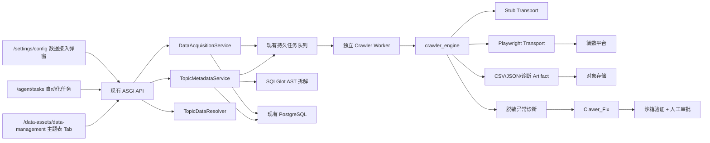

# Smart_Data_Agent 毓数爬虫数据接入技术方案

## 1. 方案说明

本方案通过独立爬虫引擎，将毓数等外部系统的数据查询、元数据获取、定时落盘和 LLM 辅助修复统一接入 Smart_Data_Agent。整体复用现有数据采集与自动化架构，仅调整数据接入弹窗、自动化任务和主题表三个页面位置，智能分析、周报等数据应用保持原有页面与交互不变。

核心约束：

- 不建设第二套任务中心、文件索引或元数据平台。
- 不让智能分析、周报等页面直接访问爬虫或文件路径。
- 不修改现有导航、页面样式和无关业务交互。
- 不允许模型修改业务 SQL、主题定义、字段语义、指标口径、输出 Schema 或账号权限。
- 爬虫异常修复固定使用模型配置 `Clawer_Fix`，不得自动降级到其他通用模型。
- 修复候选必须经过沙箱验证和人工审批，不得直接覆盖生产脚本。

## 2. 架构与代码边界



主要代码落点：

- `backend/platform/crawler_engine/`：请求契约、SQL 拆解、浏览器 DSL、安全策略、诊断、Stub、Playwright 传输和统一 Profile 注册表。
- `backend/platform/crawler_engine/systems/<system_id>/`：每个外部系统独立维护接口、选择器、筛选遍历和结果映射；系统之间不得相互依赖。
- `backend/platform/ingestion/`：继续承接作业、执行、质量门禁、分区、Artifact、最近三份保留和修复提案。
- `TopicMetadataService`：主题 SQL 拆解、原始表元数据同步、Schema 变化识别和血缘写入。
- `TopicDataResolver`：为智能分析和报告提供统一主题数据入口。
- Crawler Worker 与 API 分开部署，但共享代码、数据库、队列、对象存储、权限和审计体系。

默认使用 `SMART_DATA_AGENT_CRAWLER_TRANSPORT=stub`。只有独立 Worker 安装浏览器并设置为 `playwright` 后才进行真实访问；Stub 通过参数门禁但不会把连接标记为已验证。

## 3. 爬虫执行契约

统一请求：

```text
CrawlerRequest
- tenant_id / org_id
- operation_type: connectivity_test | data_query | metadata_query
- topic_table_id
- connection_version_id / script_version_id
- readonly_sql / parameters
- browser DSL
- timeout_seconds
- idempotency_key
```

统一结果：

```text
CrawlerResult
- status / error_code
- rows / metadata
- rows_read / schema_hash
- source_snapshot / output_cursor
- diagnostics
```

脚本使用受控动作 DSL，不执行任意 Python 或 Shell：

```text
goto → fill → click → wait → submit_sql → download_csv
goto → search_table → open_metadata → extract_metadata
goto → wait_for_url → collect_system(profile_id)
```

允许的修复字段仅包含选择器、导航地址、等待条件、下载参数和元数据列定位。动作序列、业务 SQL、输出 Schema、主题和指标定义均为不可变字段。

## 4. SQL 拆解与数据治理

SQL 使用 SQLGlot AST 解析，输出：

- 方言、语句类型、规范化 SQL 和 `query_hash`。
- CTE、子查询、Union、库/模式/表、别名。
- 输出字段、来源字段、表达式和聚合函数。
- Join 类型、关联条件、过滤、分组、排序和参数。
- 表级血缘、字段级血缘、置信度和解析告警。

仅允许单条 SELECT/WITH 查询。DDL、DML、多语句、系统命令和危险函数在进入爬虫前直接拒绝。SQL 拆解器只做解析与校验，不改写业务逻辑。

元数据支持两条路径：

1. 主题表配置：主题表卡片主动执行“获取元数据”或“获取级联元数据”。
2. 实时分析：服务端解析分析 SQL，对缺失原始表补充元数据上下文；少量表可同步处理，大任务进入异步队列。

生产状态继续写入现有模型：

| 数据概念 | 现有表 |
|---|---|
| 主题表和输出字段 | `platform_topic_tables`、`platform_topic_table_fields` |
| 原始表和字段 | `platform_datasets`、`platform_dataset_fields` |
| 主题与原始表关系 | `platform_topic_table_sources`、`platform_lineage_edges` |
| CSV/JSON 文件 | `platform_data_artifacts`、`platform_dataset_partitions` |
| 作业和执行 | `platform_acquisition_jobs`、`platform_acquisition_job_runs` |
| 修复候选 | `platform_acquisition_repair_proposals` |

`platform_dataset_fields.metadata` 保存上游注释、长度、业务说明、脱敏样例、元数据来源和版本。原始元数据响应以不可变 JSON Artifact 保存。

## 5. 实时流、离线流和保留策略

离线流：

```text
自动化任务 → acquisition.run → Crawler Worker → 毓数 SQL
→ CSV Artifact → Dataset Partition → 质量校验 → 最新可用分区
```

按租户、机构和主题表默认保留最近 3 个成功且新鲜的分区，允许配置 1–30。更早分区标记为 `stale`，对象先保留，避免误删已被分析、报告或审计引用的证据。

实时流：

```text
智能分析 SQL → TopicDataResolver → 权限/SQL 校验
→ realtime acquisition job → Crawler Worker → 结果 → 分析工作流
```

上层统一调用：

```text
getLatestCsvByTopicTable(topic_table_id, org_id, tenant_id)
resolveTopicData(topic_table_id, org_id, mode, freshness_policy)
```

周报只消费质量合格、满足新鲜度要求的成功分区，不在页面打开时启动浏览器。

## 6. Clawer_Fix 专用异常修复

爬虫异常修复模型的稳定路由键为 `Clawer_Fix`。系统配置中的模型必须满足以下任一匹配规则：

- 模型配置 `id` 等于 `Clawer_Fix`；
- 模型配置名称等于 `Clawer_Fix`；
- 已启用模型列表包含 `Clawer_Fix`。

同时必须满足 `status=available`、`testStatus=connected`。若条件不满足：

- 仍保存确定性诊断和运行证据；
- 修复提案保持人工处理状态；
- 记录 `clawer_fix_model_not_ready`；
- 不调用其他模型作为替代。

处理链路：

```text
失败 → 稳定错误分类 → 日志/DOM/截图/网络摘要脱敏
→ Clawer_Fix 生成 DSL 候选 → 静态边界校验
→ 隔离浏览器沙箱 → 人工四眼审批 → 新脚本版本 → 灰度重跑
```

稳定错误码包括登录失败、账号过期、页面变化、SQL 解析失败、元数据失败、SQL 执行失败、下载失败、Schema 变化、空结果、网络错误和需要人工验证等。

## 7. API 与页面改动

新增或扩展接口：

- `POST /api/system-config/data-connection/test`：爬虫连接执行登录页、查询页和结果页验证。
- `POST /api/data-acquisition/sql/parse`：SQL AST 拆解。
- `POST /api/data-acquisition/metadata/refresh`：普通或级联元数据获取。
- `GET /api/data-acquisition/metadata-status`：主题表元数据状态。
- `GET /api/data-acquisition/executions`：脱敏执行日志。
- `POST /api/data-acquisition/scheduled-task`：将已治理离线采集 Job 绑定到 `acquisition.run` 自动化任务。

仅修改三个页面位置：

1. `/settings/config`
   - 新增“毓数平台（爬虫）”。
   - 增加登录地址、SQL 查询页、元数据页和机构/空间标识。
   - 保留账号、密码、启用、测试、编辑和删除交互。
   - Stub 结果不得显示为已验证；验证码和 MFA 显示需要人工处理。

2. `/agent/tasks`
   - 自动化类型增加“数据获取任务”。
   - 展示当前机构、主题表、已验证连接、执行计划、保留份数和门禁状态。
   - 只有匹配的离线采集 Job、已审批脚本和已验证连接同时存在时才可创建。

3. `/data-assets/data-management`
   - 主题表展开区域增加元数据状态、获取元数据、级联获取、重新获取、日志和关联原始表摘要。
   - 不新增导航，不修改原始表 Tab 布局。

## 8. 安全与运维

- API 进程不启动浏览器；浏览器仅存在于独立 Worker。
- 每次执行使用隔离上下文，不跨租户共享 Cookie。
- 登录页、查询页和下载地址都执行出站域名、DNS/IP 和 allowlist 校验。
- 凭证仅在 Worker 运行时解密，不进入日志、Prompt、DOM 摘要或 Artifact。
- 默认总超时 240 秒，最大 900 秒；普通页面步骤最长 60 秒，人工登录等待和系统级采集最长 900 秒。
- 幂等键包含租户、机构、主题、业务日期、查询 Hash 和操作类型。
- 同一连接默认单并发；验证码、短信、MFA 和账号解锁不自动绕过。

## 9. 测试与验收

自动化测试覆盖：

- CTE、Join、Union、聚合、参数和危险 SQL 拒绝。
- DSL 动作白名单和修复不可变字段。
- Stub 不伪造真实连通性。
- Clawer_Fix 严格路由和未就绪时禁止模型降级。
- SQL 推断元数据、Schema 投影、血缘和重复刷新。
- 采集质量门禁、幂等、最近三份保留和修复审批。
- 三处页面类型检查、构建和 API 契约检查。

真实验收还需要毓数测试 URL、测试账号、只读 SQL 和页面选择器配置。上线顺序为 Stub 契约联调、测试租户 Playwright、主题表灰度、定时任务灰度、正式租户逐步启用。
