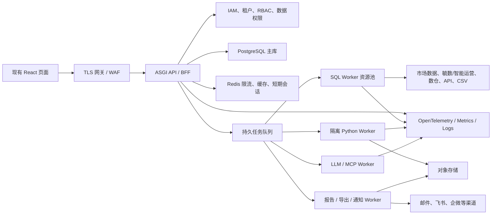

# 约 100 人使用的目标架构与容量基线

## 1. 设计边界

100 人是注册/授权用户规模，不等于 100 个分析任务同时执行。容量设计采用更保守的峰值基线：

- 100 个活跃账号，30 个同时在线会话。
- 20 个并发普通 API 请求。
- 10 个并发分析 Job，其中最多 5 个 SQL 重查询、3 个 Python 计算、5 个 LLM 调用；由不同资源池限流。
- 5 个并发报告生成或导出任务。
- 每租户和每用户独立配额，避免单个长任务拖垮全局。

这些数值是首版容量假设，必须通过压测校准，而不是写死为业务上限。

## 2. 部署形态

采用模块化单体加异步 Worker，不在 100 人规模下过早拆成大量微服务：

## 3. 可靠性目标

- 普通读 API：月可用性目标 99.9%，p95 小于 500ms（不含外部数据源）。
- 普通写 API：p95 小于 800ms，必须支持幂等键和乐观锁。
- 分析创建接口：p95 小于 1s，只负责创建 Job，不同步等待长任务。
- 任务状态：排队、运行、评审、成功、失败、取消均可恢复；Worker 崩溃后租约到期可重试。
- RPO：业务元数据和报告版本不超过 5 分钟；RTO 不超过 60 分钟。正式上线前用恢复演练证明。
- 发布门禁：Mock 证据、数据新鲜度不达标、权限/质量校验失败时禁止发布正式报告。

## 4. 数据库与存储

- PostgreSQL 是生产结构事实源；连接池按 API 和 Worker 分池，总连接数受控。
- SQLite 只用于本地开发、单元测试和离线演示，不作为多实例生产库。
- CSV、图片、文件、图表、导出和大结果集进入对象存储；数据库保存 URI、hash、大小、版本和权限。
- 审计、Outbox 和执行证据采用 append-only 模型；核心版本发布后不可原地覆盖。
- 高频列表使用 `(tenant_id, status, updated_at, id)` 等复合索引和游标分页。

## 5. 数据接入分层

统一 `SourceSystem → ConnectionVersion → Dataset → Partition/Artifact → QualityResult` 事实链：

- 市场数据：记录来源、许可、实体、指标、采集时间、观察值、证据 URL/文件 hash 和监控事件。
- 毓数/智能运营系统：通过来源映射表管理对方机构、客户、指标和主题表编码，支持 API、库表和文件批量交换。
- 实时流：直接执行授权 SQL/API，请求内携带数据源和查询版本。
- 离线流：生成不可变 CSV/Parquet Artifact，按主题表、机构、分区和版本获取最新可用快照。
- 脚本失败：告警 → 诊断 → LLM 修复建议 → 人工审批 → 新脚本版本 → 重跑；不得自动用未审批脚本覆盖生产版本。

## 6. 安全与隔离

- 企业 IdP/OIDC 登录，短期会话、可撤销刷新、设备会话和安全 Cookie。
- tenant、org、owner、metric、field、row filter 在查询编译阶段下推。
- 数据源账号只读且最小权限；密钥只保存 KMS/Vault 引用和加密密文。
- 外部 URL 经 allowlist、DNS/IP 重绑定校验和受控 egress，阻断 SSRF。
- 上传文件执行大小/类型限制、病毒扫描、内容分类、对象级访问控制。
- 所有模型、MCP、导出和推送调用执行用户/租户配额、超时和审计脱敏。

## 7. 负载与故障验收

正式验收必须覆盖：30 在线用户混合负载、10 并发分析、慢数据源、数据源 5xx、LLM 超时、Worker 崩溃、重复请求、队列积压、数据库主连接中断、对象存储失败、跨租户攻击、SSRF、备份恢复和滚动升级。只有自动化报告证明错误率、延迟、资源和恢复目标达标后，才可声称满足约 100 人稳定使用。

